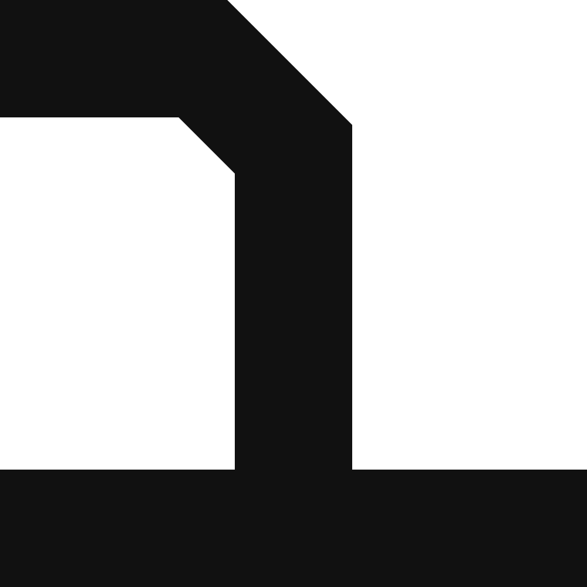
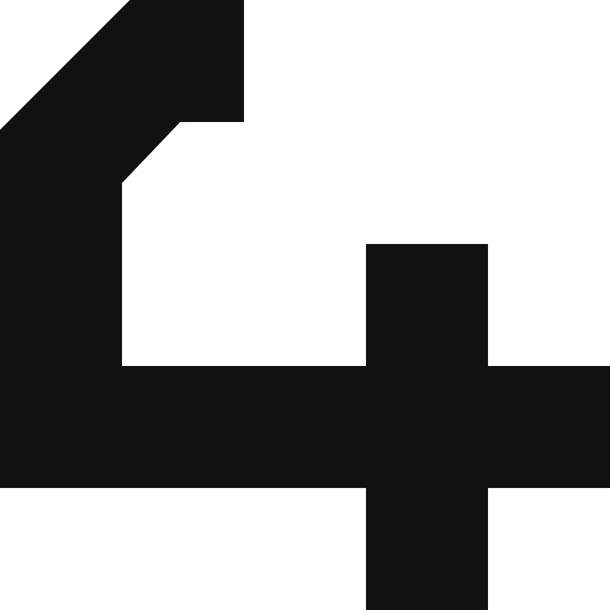
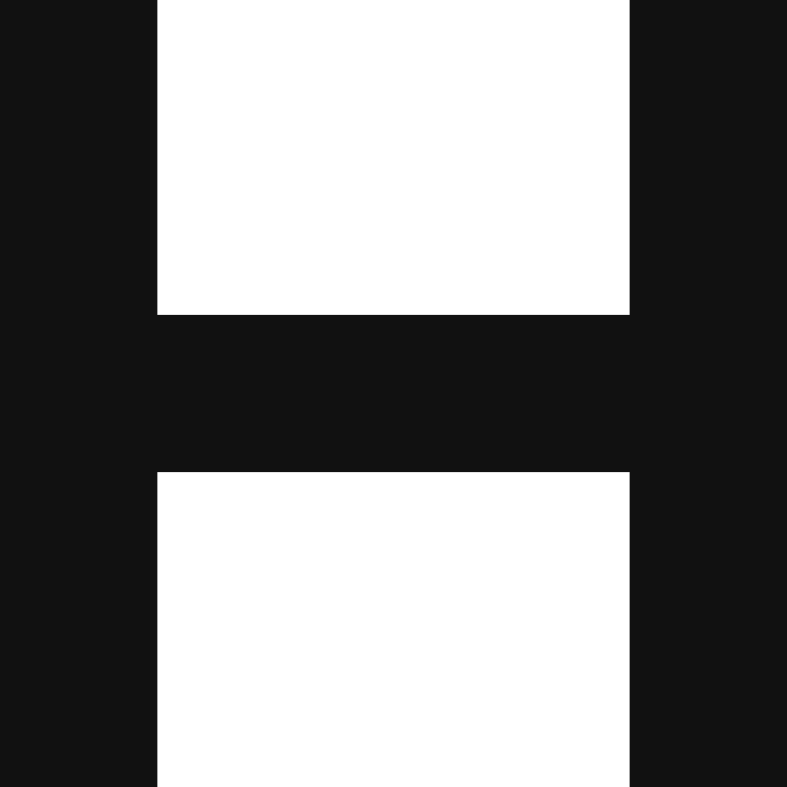

<!--suppress HtmlDeprecatedAttribute, HtmlUnknownTarget -->

  <!--
  =====================
         HEADER
  =====================
  -->
   
  <a rel="noopener noreferrer" href="https://github.com/OctalMesh/OctalFont">
    <picture>
      <source media="(prefers-color-scheme: light)" srcset="./assets/logo/svg/octalfont.svg">
      <source media="(max-width: 480px)" srcset="./assets/logo/svg/octal_font_center_white.svg">
      
    </picture>
  </a>
     
  <!--
  =====================
         BADGES
  =====================
  -->
  

    <!-- Repo Stars Badge -->
    <a rel="noopener noreferrer" href="https://github.com/OctalMesh/OctalFont/stargazers">
      <picture>
        <source media="(prefers-color-scheme: light)" srcset="https://img.shields.io/github/stars/OctalMesh/OctalFont?style=for-the-badge&logo=starship&color=363636&labelColor=464646" />
        
      </picture>
    </a>
    <!-- Repo Contributors Badge -->
    <a rel="noopener noreferrer" href="https://github.com/OctalMesh/OctalFont/contributors">
      <picture>
        <source media="(prefers-color-scheme: light)" srcset="https://img.shields.io/github/contributors/OctalMesh/OctalFont?style=for-the-badge&logo=githubsponsors&logoColor=fff&color=363636&labelColor=464646" />
        
      </picture>
    </a>
    <!-- Repo Views Badge -->
    <a rel="noopener noreferrer" href="https://hits.sh/github.com/OctalMesh/OctalFont">
      <picture>
        <source media="(prefers-color-scheme: light)" srcset="https://hits.sh/github.com/OctalMesh/OctalFont.svg?style=for-the-badge&label=Views&logo=github&color=363636&labelColor=464646" />
        
      </picture>
    </a>
  

  <h1></h1>
  <!--
  =====================
         SOURCES
  =====================
  -->
  <h6>
     
    <a rel="noopener noreferrer" href="CODE_OF_CONDUCT.md">Code of Conduct</a>
    ·
    <a rel="noopener noreferrer" href="CONTRIBUTING.md">Contributing</a>
    ·
    <a rel="noopener noreferrer" href="SUPPORT.md">Support</a>
    ·
    <a rel="noopener noreferrer" href="LICENSE-MIT.md">License MIT</a>
    ·
    <a rel="noopener noreferrer" href="LICENSE-OFL.md">License OFL</a>
     
    <a rel="noopener noreferrer" href="docs/README.md">Full Documentation</a>
    ·
    <a rel="noopener noreferrer" href="docs/design/README.md">Design Overview</a>
    ·
    <a rel="noopener noreferrer" href="docs/technical/build.md">Build Guide</a>
      
  </h6>

  <!--
  =====================
       DESCRIPTION
  =====================
  -->
  

    <strong>OctalFont</strong> is a geometric typeface family developed as
    part of the <a rel="noopener noreferrer" href="https://octalmesh.com">OctalMesh</a>
    design system. Every glyph originates as a hand-drawn sketch in a physical
    sketchbook, gets refined as a clean vector, and is then compiled into
    production-ready TTF, OTF, and WOFF files through a fully automated
    pipeline.
      
    The family name <em>«OctalFont»</em> is the registered OFL reserved name.
    Each member typeface - <em>Titan</em>, <em>Cuprum</em>, <em>Mercury</em> -
    is named after a material whose physical character directly mirrors the
    visual personality of that font.
  

  <h2>Font Families</h2>

| Family                | Named after  | Character                                                               | Intended use                                                                  |
|-----------------------|--------------|-------------------------------------------------------------------------|-------------------------------------------------------------------------------|
| **OctalFont Titan**   | Titanium     | Heavy, solid, logotype-grade. Conveys strength and permanence.          | Logos, headlines, product branding across all base OctalMesh products.        |
| **OctalFont Cuprum**  | Copper       | Thin, regular-weight, monospaced. Flexible via axis settings.           | UI labels, code, body copy - wherever clarity and neutrality matter.          |
| **OctalFont Mercury** | Mercury      | Derived from Titan, but with fluid rounded strokes. Smooth and flowing. | Portfolios and advertising for minimalist, rounded product lines. Built last. |

  <h2>Glyph Table</h2>

  

    OctalFont Titan covers <strong>482 glyphs</strong>, combining two
    <a rel="noopener noreferrer" href="https://github.com/googlefonts/glyphsets">Google Fonts glyphset</a>
    standards: <a rel="noopener noreferrer" href="https://github.com/googlefonts/glyphsets/blob/main/Lib/glyphsets/definitions/GF_Cyrillic_Plus.yaml"><code>GF_Cyrillic_Plus</code></a>
    and <a rel="noopener noreferrer" href="https://github.com/googlefonts/glyphsets/blob/main/Lib/glyphsets/definitions/GF_Latin_Core.yaml"><code>GF_Latin_Core</code></a>.
    Together they cover the typographic needs of <strong>~50 languages</strong> across the
    Latin and Cyrillic scripts - from core Western European languages to Turkic, Caucasian,
    and Uralic languages written in Cyrillic.
  

  

    Show glyph table <strong>(OctalFont-Titan)</strong>
  

| SVG                                                                                                                                                                                                                                                    | Code     | Character | Full Name                                                    | Fine Name                     | Prod Name                     |
|--------------------------------------------------------------------------------------------------------------------------------------------------------------------------------------------------------------------------------------------------------|----------|-----------|--------------------------------------------------------------|-------------------------------|-------------------------------|
|                                                                         | `0x0024` | $         | DOLLAR SIGN                                                  | `dollar`                      | `dollar`                      |
|                                                                      | `0x0025` | %         | PERCENT SIGN                                                 | `percent`                     | `percent`                     |
|                                                                | `0x0026` | &         | AMPERSAND                                                    | `ampersand`                   | `ampersand`                   |
|                                                                               | `0x002B` | +         | PLUS SIGN                                                    | `plus`                        | `plus`                        |
|                                                                               | `0x003C` | <         | LESS-THAN SIGN                                               | `less`                        | `less`                        |
|                                                                            | `0x003D` | =         | EQUALS SIGN                                                  | `equal`                       | `equal`                       |
|                                                                      | `0x003E` | \>        | GREATER-THAN SIGN                                            | `greater`                     | `greater`                     |
|                                                                                     | `0x0040` | @         | COMMERCIAL AT                                                | `at`                          | `at`                          |
|                                                          | `0x005E` | ^         | CIRCUMFLEX ACCENT                                            | `asciicircum`                 | `asciicircum`                 |
|                                                                                  | `0x007C` | \|        | VERTICAL LINE                                                | `bar`                         | `bar`                         |
|                                                             | `0x007E` | ~         | TILDE                                                        | `asciitilde`                  | `asciitilde`                  |
|                                                                               | `0x00A2` | ¢         | CENT SIGN                                                    | `cent`                        | `cent`                        |
|                                                                   | `0x00A3` | £         | POUND SIGN                                                   | `sterling`                    | `sterling`                    |
|                                                                                  | `0x00A5` | ¥         | YEN SIGN                                                     | `yen`                         | `yen`                         |
|                                                                      | `0x00A7` | §         | SECTION SIGN                                                 | `section`                     | `section`                     |
|                                                                | `0x00A9` | ©         | COPYRIGHT SIGN                                               | `copyright`                   | `copyright`                   |
|                                                             | `0x00AE` | ®         | REGISTERED SIGN                                              | `registered`                  | `registered`                  |
|                                                                         | `0x00B0` | °         | DEGREE SIGN                                                  | `degree`                      | `degree`                      |
|                                                                | `0x00B6` | ¶         | PILCROW SIGN                                                 | `paragraph`                   | `paragraph`                   |
|                                                                   | `0x00D7` | ×         | MULTIPLICATION SIGN                                          | `multiply`                    | `multiply`                    |
|                                                                         | `0x00F7` | ÷         | DIVISION SIGN                                                | `divide`                      | `divide`                      |
|                                                                               | `0x20AC` | €         | EURO SIGN                                                    | `euro`                        | `Euro`                        |
|                                                                         | `0x2116` | №         | NUMERO SIGN                                                  | `numero`                      | `uni2116`                     |
|                                                                | `0x2122` | ™         | TRADE MARK SIGN                                              | `trademark`                   | `trademark`                   |
|                                                                            | `0x2212` | −         | MINUS SIGN                                                   | `minus`                       | `minus`                       |
|                                                                    | `0x0020` | ␠ (space) | SPACE                                                        | `space`                       | `space`                       |
|                                                                 | `0x0021` | !         | EXCLAMATION MARK                                             | `exclam`                      | `exclam`                      |
|                                                           | `0x0022` | "         | QUOTATION MARK                                               | `quotedbl`                    | `quotedbl`                    |
|                                                     | `0x0023` | #         | NUMBER SIGN                                                  | `numbersign`                  | `numbersign`                  |
|                                                  | `0x0027` | '         | APOSTROPHE                                                   | `quotesingle`                 | `quotesingle`                 |
|                                                        | `0x0028` | (         | LEFT PARENTHESIS                                             | `parenleft`                   | `parenleft`                   |
|                                                     | `0x0029` | )         | RIGHT PARENTHESIS                                            | `parenright`                  | `parenright`                  |
|                                                           | `0x002A` | *         | ASTERISK                                                     | `asterisk`                    | `asterisk`                    |
|                                                                    | `0x002C` | ,         | COMMA                                                        | `comma`                       | `comma`                       |
|                                                                 | `0x002D` | -         | HYPHEN-MINUS                                                 | `hyphen`                      | `hyphen`                      |
|                                                                 | `0x002E` | .         | FULL STOP                                                    | `period`                      | `period`                      |
|                                                                    | `0x002F` | /         | SOLIDUS                                                      | `slash`                       | `slash`                       |
|                                                                    | `0x003A` | :         | COLON                                                        | `colon`                       | `colon`                       |
|                                                        | `0x003B` | ;         | SEMICOLON                                                    | `semicolon`                   | `semicolon`                   |
|                                                           | `0x003F` | ?         | QUESTION MARK                                                | `question`                    | `question`                    |
|                                                  | `0x005B` | [         | LEFT SQUARE BRACKET                                          | `bracketleft`                 | `bracketleft`                 |
|                                                        | `0x005C` | \         | REVERSE SOLIDUS                                              | `backslash`                   | `backslash`                   |
|                                               | `0x005D` | ]         | RIGHT SQUARE BRACKET                                         | `bracketright`                | `bracketright`                |
|                                                     | `0x005F` | _         | LOW LINE                                                     | `underscore`                  | `underscore`                  |
|                                                        | `0x007B` | {         | LEFT CURLY BRACKET                                           | `braceleft`                   | `braceleft`                   |
|                                                     | `0x007D` | }         | RIGHT CURLY BRACKET                                          | `braceright`                  | `braceright`                  |
|                                                              | `0x00A0` | ⍽ (nbsp)  | NO-BREAK SPACE                                               | `nbspace`                     | `uni00A0`                     |
|                                                     | `0x00A1` | ¡         | INVERTED EXCLAMATION MARK                                    | `exclamdown`                  | `exclamdown`                  |
|                                            | `0x00AB` | «         | LEFT-POINTING DOUBLE ANGLE QUOTATION MARK                    | `guillemetleft`               | `guillemotleft`               |
|                                         | `0x00B7` | ·         | MIDDLE DOT                                                   | `periodcentered`              | `periodcentered`              |
|                                         | `0x00BB` | »         | RIGHT-POINTING DOUBLE ANGLE QUOTATION MARK                   | `guillemetright`              | `guillemotright`              |
|                                               | `0x00BF` | ¿         | INVERTED QUESTION MARK                                       | `questiondown`                | `questiondown`                |
|                                                                 | `0x2013` | –         | EN DASH                                                      | `endash`                      | `endash`                      |
|                                                                 | `0x2014` | —         | EM DASH                                                      | `emdash`                      | `emdash`                      |
|                                                        | `0x2018` | ‘         | LEFT SINGLE QUOTATION MARK                                   | `quoteleft`                   | `quoteleft`                   |
|                                                     | `0x2019` | ’         | RIGHT SINGLE QUOTATION MARK                                  | `quoteright`                  | `quoteright`                  |
|                                         | `0x201A` | ‚         | SINGLE LOW-9 QUOTATION MARK                                  | `quotesinglbase`              | `quotesinglbase`              |
|                                               | `0x201C` | “         | LEFT DOUBLE QUOTATION MARK                                   | `quotedblleft`                | `quotedblleft`                |
|                                            | `0x201D` | ”         | RIGHT DOUBLE QUOTATION MARK                                  | `quotedblright`               | `quotedblright`               |
|                                               | `0x201E` | „         | DOUBLE LOW-9 QUOTATION MARK                                  | `quotedblbase`                | `quotedblbase`                |
|                                                                 | `0x2022` | •         | BULLET                                                       | `bullet`                      | `bullet`                      |
|                                                           | `0x2026` | …         | HORIZONTAL ELLIPSIS                                          | `ellipsis`                    | `ellipsis`                    |
|                                            | `0x2039` | ‹         | SINGLE LEFT-POINTING ANGLE QUOTATION MARK                    | `guilsinglleft`               | `guilsinglleft`               |
|                                         | `0x203A` | ›         | SINGLE RIGHT-POINTING ANGLE QUOTATION MARK                   | `guilsinglright`              | `guilsinglright`              |
|                                                              | `-`      | - (GSUB)  | NOTDEF - MISSING GLYPH PLACEHOLDER                           | `.notdef`                     | `.notdef`                     |
|                 | `-`      | - (GSUB)  | MIDDLE DOT - CATALAN LOCALE VARIANT (l·l)                    | `periodcentered.loclCAT`      | `periodcentered.loclCAT`      |
|  | `-`      | - (GSUB)  | MIDDLE DOT - CATALAN LOCALE VARIANT, UPPERCASE CONTEXT (L·L) | `periodcentered.loclCAT.case` | `periodcentered.loclCAT.case` |
|                                                                                 | `0x0030` | 0         | DIGIT ZERO                                                   | `zero`                        | `zero`                        |
|                                                                                    | `0x0031` | 1         | DIGIT ONE                                                    | `one`                         | `one`                         |
|                                                                                    | `0x0032` | 2         | DIGIT TWO                                                    | `two`                         | `two`                         |
|                                                                              | `0x0033` | 3         | DIGIT THREE                                                  | `three`                       | `three`                       |
|                                                                                 | `0x0034` | 4         | DIGIT FOUR                                                   | `four`                        | `four`                        |
|                                                                                 | `0x0035` | 5         | DIGIT FIVE                                                   | `five`                        | `five`                        |
|                                                                                    | `0x0036` | 6         | DIGIT SIX                                                    | `six`                         | `six`                         |
|                                                                              | `0x0037` | 7         | DIGIT SEVEN                                                  | `seven`                       | `seven`                       |
|                                                                              | `0x0038` | 8         | DIGIT EIGHT                                                  | `eight`                       | `eight`                       |
|                                                                                 | `0x0039` | 9         | DIGIT NINE                                                   | `nine`                        | `nine`                        |
|                                                                                | `0x0060` | `         | GRAVE ACCENT                                                 | `grave`                       | `grave`                       |
|                                                                       | `0x00A8` | ¨         | DIAERESIS                                                    | `dieresis`                    | `dieresis`                    |
|                                                                             | `0x00AF` | ¯         | MACRON                                                       | `macron`                      | `macron`                      |
|                                                                                | `0x00B4` | ´         | ACUTE ACCENT                                                 | `acute`                       | `acute`                       |
|                                                                          | `0x00B8` | ¸         | CEDILLA                                                      | `cedilla`                     | `cedilla`                     |
|                                                        | `0x02BC` | ʼ         | MODIFIER LETTER APOSTROPHE                                   | `apostrophemod`               | `uni02BC`                     |
|                                                                 | `0x02C6` | ˆ         | MODIFIER LETTER CIRCUMFLEX ACCENT                            | `circumflex`                  | `circumflex`                  |
|                                                                                | `0x02C7` | ˇ         | CARON                                                        | `caron`                       | `caron`                       |
|                                                                                | `0x02D8` | ˘         | BREVE                                                        | `breve`                       | `breve`                       |
|                                                                    | `0x02D9` | ˙         | DOT ABOVE                                                    | `dotaccent`                   | `dotaccent`                   |
|                                                                                   | `0x02DA` | ˚         | RING ABOVE                                                   | `ring`                        | `ring`                        |
|                                                                             | `0x02DB` | ˛         | OGONEK                                                       | `ogonek`                      | `ogonek`                      |
|                                                                                | `0x02DC` | ˜         | SMALL TILDE                                                  | `tilde`                       | `tilde`                       |
|                                                           | `0x02DD` | ˝         | DOUBLE ACUTE ACCENT                                          | `hungarumlaut`                | `hungarumlaut`                |
|                                                                    | `0x0300` | ̀         | COMBINING GRAVE ACCENT                                       | `gravecomb`                   | `gravecomb`                   |
|                                                                    | `0x0301` | ́         | COMBINING ACUTE ACCENT                                       | `acutecomb`                   | `acutecomb`                   |
|                                                     | `0x0302` | ̂         | COMBINING CIRCUMFLEX ACCENT                                  | `circumflexcomb`              | `uni0302`                     |
|                                                                    | `0x0303` | ̃         | COMBINING TILDE                                              | `tildecomb`                   | `tildecomb`                   |
|                                                                 | `0x0304` | ̄         | COMBINING MACRON                                             | `macroncomb`                  | `uni0304`                     |
|                                                                    | `0x0306` | ̆         | COMBINING BREVE                                              | `brevecomb`                   | `uni0306`                     |
|                                                        | `0x0307` | ̇         | COMBINING DOT ABOVE                                          | `dotaccentcomb`               | `uni0307`                     |
|                                                           | `0x0308` | ̈         | COMBINING DIAERESIS                                          | `dieresiscomb`                | `uni0308`                     |
|                                                                       | `0x030A` | ̊         | COMBINING RING ABOVE                                         | `ringcomb`                    | `uni030A`                     |
|                                               | `0x030B` | ̋         | COMBINING DOUBLE ACUTE ACCENT                                | `hungarumlautcomb`            | `uni030B`                     |
|                                                                    | `0x030C` | ̌         | COMBINING CARON                                              | `caroncomb`                   | `uni030C`                     |
|                                                  | `0x0326` | ̦         | COMBINING COMMA BELOW                                        | `commaaccentcomb`             | `uni0326`                     |
|                                                              | `0x0327` | ̧         | COMBINING CEDILLA                                            | `cedillacomb`                 | `uni0327`                     |
|                                                                 | `0x0328` | ̨         | COMBINING OGONEK                                             | `ogonekcomb`                  | `uni0328`                     |
|                                                        | `-`      | - (GSUB)  | COMBINING CARON - ALTERNATE FORM                             | `caroncomb.alt`               | `uni030C.alt`                 |
|                                                                                    | `0x0041` | A         | LATIN CAPITAL LETTER A                                       | `A`                           | `A`                           |
|                                                                                    | `0x0042` | B         | LATIN CAPITAL LETTER B                                       | `B`                           | `B`                           |
|                                                                                    | `0x0043` | C         | LATIN CAPITAL LETTER C                                       | `C`                           | `C`                           |
|                                                                                    | `0x0044` | D         | LATIN CAPITAL LETTER D                                       | `D`                           | `D`                           |
|                                                                                    | `0x0045` | E         | LATIN CAPITAL LETTER E                                       | `E`                           | `E`                           |
|                                                                                    | `0x0046` | F         | LATIN CAPITAL LETTER F                                       | `F`                           | `F`                           |
|                                                                                    | `0x0047` | G         | LATIN CAPITAL LETTER G                                       | `G`                           | `G`                           |
|                                                                                    | `0x0048` | H         | LATIN CAPITAL LETTER H                                       | `H`                           | `H`                           |
|                                                                                    | `0x0049` | I         | LATIN CAPITAL LETTER I                                       | `I`                           | `I`                           |
|                                                                                    | `0x004A` | J         | LATIN CAPITAL LETTER J                                       | `J`                           | `J`                           |
|                                                                                    | `0x004B` | K         | LATIN CAPITAL LETTER K                                       | `K`                           | `K`                           |
|                                                                                    | `0x004C` | L         | LATIN CAPITAL LETTER L                                       | `L`                           | `L`                           |
|                                                                                    | `0x004D` | M         | LATIN CAPITAL LETTER M                                       | `M`                           | `M`                           |
|                                                                                    | `0x004E` | N         | LATIN CAPITAL LETTER N                                       | `N`                           | `N`                           |
|                                                                                    | `0x004F` | O         | LATIN CAPITAL LETTER O                                       | `O`                           | `O`                           |
|                                                                                    | `0x0050` | P         | LATIN CAPITAL LETTER P                                       | `P`                           | `P`                           |
|                                                                                    | `0x0051` | Q         | LATIN CAPITAL LETTER Q                                       | `Q`                           | `Q`                           |
|                                                                                    | `0x0052` | R         | LATIN CAPITAL LETTER R                                       | `R`                           | `R`                           |
|                                                                                    | `0x0053` | S         | LATIN CAPITAL LETTER S                                       | `S`                           | `S`                           |
|                                                                                    | `0x0054` | T         | LATIN CAPITAL LETTER T                                       | `T`                           | `T`                           |
|                                                                                    | `0x0055` | U         | LATIN CAPITAL LETTER U                                       | `U`                           | `U`                           |
|                                                                                    | `0x0056` | V         | LATIN CAPITAL LETTER V                                       | `V`                           | `V`                           |
|                                                                                    | `0x0057` | W         | LATIN CAPITAL LETTER W                                       | `W`                           | `W`                           |
|                                                                                    | `0x0058` | X         | LATIN CAPITAL LETTER X                                       | `X`                           | `X`                           |
|                                                                                    | `0x0059` | Y         | LATIN CAPITAL LETTER Y                                       | `Y`                           | `Y`                           |
|                                                                                    | `0x005A` | Z         | LATIN CAPITAL LETTER Z                                       | `Z`                           | `Z`                           |
|                                                                     | `0x00C0` | À         | LATIN CAPITAL LETTER A WITH GRAVE                            | `Agrave`                      | `Agrave`                      |
|                                                                     | `0x00C1` | Á         | LATIN CAPITAL LETTER A WITH ACUTE                            | `Aacute`                      | `Aacute`                      |
|                                                      | `0x00C2` | Â         | LATIN CAPITAL LETTER A WITH CIRCUMFLEX                       | `Acircumflex`                 | `Acircumflex`                 |
|                                                                     | `0x00C3` | Ã         | LATIN CAPITAL LETTER A WITH TILDE                            | `Atilde`                      | `Atilde`                      |
|                                                            | `0x00C4` | Ä         | LATIN CAPITAL LETTER A WITH DIAERESIS                        | `Adieresis`                   | `Adieresis`                   |
|                                                                        | `0x00C5` | Å         | LATIN CAPITAL LETTER A WITH RING ABOVE                       | `Aring`                       | `Aring`                       |
|                                                                                 | `0x00C6` | Æ         | LATIN CAPITAL LETTER AE                                      | `AE`                          | `AE`                          |
|                                                               | `0x00C7` | Ç         | LATIN CAPITAL LETTER C WITH CEDILLA                          | `Ccedilla`                    | `Ccedilla`                    |
|                                                                     | `0x00C8` | È         | LATIN CAPITAL LETTER E WITH GRAVE                            | `Egrave`                      | `Egrave`                      |
|                                                                     | `0x00C9` | É         | LATIN CAPITAL LETTER E WITH ACUTE                            | `Eacute`                      | `Eacute`                      |
|                                                      | `0x00CA` | Ê         | LATIN CAPITAL LETTER E WITH CIRCUMFLEX                       | `Ecircumflex`                 | `Ecircumflex`                 |
|                                                            | `0x00CB` | Ë         | LATIN CAPITAL LETTER E WITH DIAERESIS                        | `Edieresis`                   | `Edieresis`                   |
|                                                                     | `0x00CC` | Ì         | LATIN CAPITAL LETTER I WITH GRAVE                            | `Igrave`                      | `Igrave`                      |
|                                                                     | `0x00CD` | Í         | LATIN CAPITAL LETTER I WITH ACUTE                            | `Iacute`                      | `Iacute`                      |
|                                                      | `0x00CE` | Î         | LATIN CAPITAL LETTER I WITH CIRCUMFLEX                       | `Icircumflex`                 | `Icircumflex`                 |
|                                                            | `0x00CF` | Ï         | LATIN CAPITAL LETTER I WITH DIAERESIS                        | `Idieresis`                   | `Idieresis`                   |
|                                                                              | `0x00D0` | Ð         | LATIN CAPITAL LETTER ETH                                     | `Eth`                         | `Eth`                         |
|                                                                     | `0x00D1` | Ñ         | LATIN CAPITAL LETTER N WITH TILDE                            | `Ntilde`                      | `Ntilde`                      |
|                                                                     | `0x00D2` | Ò         | LATIN CAPITAL LETTER O WITH GRAVE                            | `Ograve`                      | `Ograve`                      |
|                                                                     | `0x00D3` | Ó         | LATIN CAPITAL LETTER O WITH ACUTE                            | `Oacute`                      | `Oacute`                      |
|                                                      | `0x00D4` | Ô         | LATIN CAPITAL LETTER O WITH CIRCUMFLEX                       | `Ocircumflex`                 | `Ocircumflex`                 |
|                                                                     | `0x00D5` | Õ         | LATIN CAPITAL LETTER O WITH TILDE                            | `Otilde`                      | `Otilde`                      |
|                                                            | `0x00D6` | Ö         | LATIN CAPITAL LETTER O WITH DIAERESIS                        | `Odieresis`                   | `Odieresis`                   |
|                                                                     | `0x00D8` | Ø         | LATIN CAPITAL LETTER O WITH STROKE                           | `Oslash`                      | `Oslash`                      |
|                                                                     | `0x00D9` | Ù         | LATIN CAPITAL LETTER U WITH GRAVE                            | `Ugrave`                      | `Ugrave`                      |
|                                                                     | `0x00DA` | Ú         | LATIN CAPITAL LETTER U WITH ACUTE                            | `Uacute`                      | `Uacute`                      |
|                                                      | `0x00DB` | Û         | LATIN CAPITAL LETTER U WITH CIRCUMFLEX                       | `Ucircumflex`                 | `Ucircumflex`                 |
|                                                            | `0x00DC` | Ü         | LATIN CAPITAL LETTER U WITH DIAERESIS                        | `Udieresis`                   | `Udieresis`                   |
|                                                                     | `0x00DD` | Ý         | LATIN CAPITAL LETTER Y WITH ACUTE                            | `Yacute`                      | `Yacute`                      |
|                                                                        | `0x00DE` | Þ         | LATIN CAPITAL LETTER THORN                                   | `Thorn`                       | `Thorn`                       |
|                                                                  | `0x0100` | Ā         | LATIN CAPITAL LETTER A WITH MACRON                           | `Amacron`                     | `Amacron`                     |
|                                                                     | `0x0102` | Ă         | LATIN CAPITAL LETTER A WITH BREVE                            | `Abreve`                      | `Abreve`                      |
|                                                                  | `0x0104` | Ą         | LATIN CAPITAL LETTER A WITH OGONEK                           | `Aogonek`                     | `Aogonek`                     |
|                                                                     | `0x0106` | Ć         | LATIN CAPITAL LETTER C WITH ACUTE                            | `Cacute`                      | `Cacute`                      |
|                                                         | `0x010A` | Ċ         | LATIN CAPITAL LETTER C WITH DOT ABOVE                        | `Cdotaccent`                  | `Cdotaccent`                  |
|                                                                     | `0x010C` | Č         | LATIN CAPITAL LETTER C WITH CARON                            | `Ccaron`                      | `Ccaron`                      |
|                                                                     | `0x010E` | Ď         | LATIN CAPITAL LETTER D WITH CARON                            | `Dcaron`                      | `Dcaron`                      |
|                                                                     | `0x0110` | Đ         | LATIN CAPITAL LETTER D WITH STROKE                           | `Dcroat`                      | `Dcroat`                      |
|                                                                  | `0x0112` | Ē         | LATIN CAPITAL LETTER E WITH MACRON                           | `Emacron`                     | `Emacron`                     |
|                                                         | `0x0116` | Ė         | LATIN CAPITAL LETTER E WITH DOT ABOVE                        | `Edotaccent`                  | `Edotaccent`                  |
|                                                                  | `0x0118` | Ę         | LATIN CAPITAL LETTER E WITH OGONEK                           | `Eogonek`                     | `Eogonek`                     |
|                                                                     | `0x011A` | Ě         | LATIN CAPITAL LETTER E WITH CARON                            | `Ecaron`                      | `Ecaron`                      |
|                                                                     | `0x011E` | Ğ         | LATIN CAPITAL LETTER G WITH BREVE                            | `Gbreve`                      | `Gbreve`                      |
|                                                         | `0x0120` | Ġ         | LATIN CAPITAL LETTER G WITH DOT ABOVE                        | `Gdotaccent`                  | `Gdotaccent`                  |
|                                                   | `0x0122` | Ģ         | LATIN CAPITAL LETTER G WITH CEDILLA                          | `Gcommaaccent`                | `uni0122`                     |
|                                                                           | `0x0126` | Ħ         | LATIN CAPITAL LETTER H WITH STROKE                           | `Hbar`                        | `Hbar`                        |
|                                                                  | `0x012A` | Ī         | LATIN CAPITAL LETTER I WITH MACRON                           | `Imacron`                     | `Imacron`                     |
|                                                                  | `0x012E` | Į         | LATIN CAPITAL LETTER I WITH OGONEK                           | `Iogonek`                     | `Iogonek`                     |
|                                                         | `0x0130` | İ         | LATIN CAPITAL LETTER I WITH DOT ABOVE                        | `Idotaccent`                  | `Idotaccent`                  |
|                                                   | `0x0136` | Ķ         | LATIN CAPITAL LETTER K WITH CEDILLA                          | `Kcommaaccent`                | `uni0136`                     |
|                                                                     | `0x0139` | Ĺ         | LATIN CAPITAL LETTER L WITH ACUTE                            | `Lacute`                      | `Lacute`                      |
|                                                   | `0x013B` | Ļ         | LATIN CAPITAL LETTER L WITH CEDILLA                          | `Lcommaaccent`                | `uni013B`                     |
|                                                                     | `0x013D` | Ľ         | LATIN CAPITAL LETTER L WITH CARON                            | `Lcaron`                      | `Lcaron`                      |
|                                                                     | `0x0141` | Ł         | LATIN CAPITAL LETTER L WITH STROKE                           | `Lslash`                      | `Lslash`                      |
|                                                                     | `0x0143` | Ń         | LATIN CAPITAL LETTER N WITH ACUTE                            | `Nacute`                      | `Nacute`                      |
|                                                   | `0x0145` | Ņ         | LATIN CAPITAL LETTER N WITH CEDILLA                          | `Ncommaaccent`                | `uni0145`                     |
|                                                                     | `0x0147` | Ň         | LATIN CAPITAL LETTER N WITH CARON                            | `Ncaron`                      | `Ncaron`                      |
|                                                | `0x0150` | Ő         | LATIN CAPITAL LETTER O WITH DOUBLE ACUTE                     | `Ohungarumlaut`               | `Ohungarumlaut`               |
|                                                                                 | `0x0152` | Π        | LATIN CAPITAL LIGATURE OE                                    | `OE`                          | `OE`                          |
|                                                                     | `0x0154` | Ŕ         | LATIN CAPITAL LETTER R WITH ACUTE                            | `Racute`                      | `Racute`                      |
|                                                                     | `0x0158` | Ř         | LATIN CAPITAL LETTER R WITH CARON                            | `Rcaron`                      | `Rcaron`                      |
|                                                                     | `0x015A` | Ś         | LATIN CAPITAL LETTER S WITH ACUTE                            | `Sacute`                      | `Sacute`                      |
|                                                               | `0x015E` | Ş         | LATIN CAPITAL LETTER S WITH CEDILLA                          | `Scedilla`                    | `Scedilla`                    |
|                                                                     | `0x0160` | Š         | LATIN CAPITAL LETTER S WITH CARON                            | `Scaron`                      | `Scaron`                      |
|                                                                     | `0x0164` | Ť         | LATIN CAPITAL LETTER T WITH CARON                            | `Tcaron`                      | `Tcaron`                      |
|                                                                  | `0x016A` | Ū         | LATIN CAPITAL LETTER U WITH MACRON                           | `Umacron`                     | `Umacron`                     |
|                                                                        | `0x016E` | Ů         | LATIN CAPITAL LETTER U WITH RING ABOVE                       | `Uring`                       | `Uring`                       |
|                                                | `0x0170` | Ű         | LATIN CAPITAL LETTER U WITH DOUBLE ACUTE                     | `Uhungarumlaut`               | `Uhungarumlaut`               |
|                                                                  | `0x0172` | Ų         | LATIN CAPITAL LETTER U WITH OGONEK                           | `Uogonek`                     | `Uogonek`                     |
|                                                      | `0x0174` | Ŵ         | LATIN CAPITAL LETTER W WITH CIRCUMFLEX                       | `Wcircumflex`                 | `Wcircumflex`                 |
|                                                      | `0x0176` | Ŷ         | LATIN CAPITAL LETTER Y WITH CIRCUMFLEX                       | `Ycircumflex`                 | `Ycircumflex`                 |
|                                                            | `0x0178` | Ÿ         | LATIN CAPITAL LETTER Y WITH DIAERESIS                        | `Ydieresis`                   | `Ydieresis`                   |
|                                                                     | `0x0179` | Ź         | LATIN CAPITAL LETTER Z WITH ACUTE                            | `Zacute`                      | `Zacute`                      |
|                                                         | `0x017B` | Ż         | LATIN CAPITAL LETTER Z WITH DOT ABOVE                        | `Zdotaccent`                  | `Zdotaccent`                  |
|                                                                     | `0x017D` | Ž         | LATIN CAPITAL LETTER Z WITH CARON                            | `Zcaron`                      | `Zcaron`                      |
|                                                   | `0x0218` | Ș         | LATIN CAPITAL LETTER S WITH COMMA BELOW                      | `Scommaaccent`                | `uni0218`                     |
|                                                   | `0x021A` | Ț         | LATIN CAPITAL LETTER T WITH COMMA BELOW                      | `Tcommaaccent`                | `uni021A`                     |
|                                                                        | `0x0401` | Ё         | CYRILLIC CAPITAL LETTER IO                                   | `Io-cy`                       | `uni0401`                     |
|                                                                     | `0x0402` | Ђ         | CYRILLIC CAPITAL LETTER DJE                                  | `Dje-cy`                      | `uni0402`                     |
|                                                                     | `0x0403` | Ѓ         | CYRILLIC CAPITAL LETTER GJE                                  | `Gje-cy`                      | `uni0403`                     |
|                                                                           | `0x0404` | Є         | CYRILLIC CAPITAL LETTER UKRAINIAN IE                         | `E-cy`                        | `uni0404`                     |
|                                                                     | `0x0405` | Ѕ         | CYRILLIC CAPITAL LETTER DZE                                  | `Dze-cy`                      | `uni0405`                     |
|                                                                           | `0x0406` | І         | CYRILLIC CAPITAL LETTER BYELORUSSIAN-UKRAINIAN I             | `I-cy`                        | `uni0406`                     |
|                                                                        | `0x0407` | Ї         | CYRILLIC CAPITAL LETTER YI                                   | `Yi-cy`                       | `uni0407`                     |
|                                                                        | `0x0408` | Ј         | CYRILLIC CAPITAL LETTER JE                                   | `Je-cy`                       | `uni0408`                     |
|                                                                     | `0x0409` | Љ         | CYRILLIC CAPITAL LETTER LJE                                  | `Lje-cy`                      | `uni0409`                     |
|                                                                     | `0x040A` | Њ         | CYRILLIC CAPITAL LETTER NJE                                  | `Nje-cy`                      | `uni040A`                     |
|                                                                  | `0x040B` | Ћ         | CYRILLIC CAPITAL LETTER TSHE                                 | `Tshe-cy`                     | `uni040B`                     |
|                                                                     | `0x040C` | Ќ         | CYRILLIC CAPITAL LETTER KJE                                  | `Kje-cy`                      | `uni040C`                     |
|                                                            | `0x040E` | Ў         | CYRILLIC CAPITAL LETTER SHORT U                              | `Ushort-cy`                   | `uni040E`                     |
|                                                                  | `0x040F` | Џ         | CYRILLIC CAPITAL LETTER DZHE                                 | `Dzhe-cy`                     | `uni040F`                     |
|                                                                           | `0x0410` | А         | CYRILLIC CAPITAL LETTER A                                    | `A-cy`                        | `uni0410`                     |
|                                                                        | `0x0411` | Б         | CYRILLIC CAPITAL LETTER BE                                   | `Be-cy`                       | `uni0411`                     |
|                                                                        | `0x0412` | В         | CYRILLIC CAPITAL LETTER VE                                   | `Ve-cy`                       | `uni0412`                     |
|                                                                        | `0x0413` | Г         | CYRILLIC CAPITAL LETTER GHE                                  | `Ge-cy`                       | `uni0413`                     |
|                                                                        | `0x0414` | Д         | CYRILLIC CAPITAL LETTER DE                                   | `De-cy`                       | `uni0414`                     |
|                                                                        | `0x0415` | Е         | CYRILLIC CAPITAL LETTER IE                                   | `Ie-cy`                       | `uni0415`                     |
|                                                                     | `0x0416` | Ж         | CYRILLIC CAPITAL LETTER ZHE                                  | `Zhe-cy`                      | `uni0416`                     |
|                                                                        | `0x0417` | З         | CYRILLIC CAPITAL LETTER ZE                                   | `Ze-cy`                       | `uni0417`                     |
|                                                                        | `0x0418` | И         | CYRILLIC CAPITAL LETTER I                                    | `Ii-cy`                       | `uni0418`                     |
|                                                         | `0x0419` | Й         | CYRILLIC CAPITAL LETTER SHORT I                              | `Iishort-cy`                  | `uni0419`                     |
|                                                                        | `0x041A` | К         | CYRILLIC CAPITAL LETTER KA                                   | `Ka-cy`                       | `uni041A`                     |
|                                                                        | `0x041B` | Л         | CYRILLIC CAPITAL LETTER EL                                   | `El-cy`                       | `uni041B`                     |
|                                                                        | `0x041C` | М         | CYRILLIC CAPITAL LETTER EM                                   | `Em-cy`                       | `uni041C`                     |
|                                                                        | `0x041D` | Н         | CYRILLIC CAPITAL LETTER EN                                   | `En-cy`                       | `uni041D`                     |
|                                                                           | `0x041E` | О         | CYRILLIC CAPITAL LETTER O                                    | `O-cy`                        | `uni041E`                     |
|                                                                        | `0x041F` | П         | CYRILLIC CAPITAL LETTER PE                                   | `Pe-cy`                       | `uni041F`                     |
|                                                                        | `0x0420` | Р         | CYRILLIC CAPITAL LETTER ER                                   | `Er-cy`                       | `uni0420`                     |
|                                                                        | `0x0421` | С         | CYRILLIC CAPITAL LETTER ES                                   | `Es-cy`                       | `uni0421`                     |
|                                                                        | `0x0422` | Т         | CYRILLIC CAPITAL LETTER TE                                   | `Te-cy`                       | `uni0422`                     |
|                                                                           | `0x0423` | У         | CYRILLIC CAPITAL LETTER U                                    | `U-cy`                        | `uni0423`                     |
|                                                                        | `0x0424` | Ф         | CYRILLIC CAPITAL LETTER EF                                   | `Ef-cy`                       | `uni0424`                     |
|                                                                        | `0x0425` | Х         | CYRILLIC CAPITAL LETTER HA                                   | `Ha-cy`                       | `uni0425`                     |
|                                                                     | `0x0426` | Ц         | CYRILLIC CAPITAL LETTER TSE                                  | `Tse-cy`                      | `uni0426`                     |
|                                                                     | `0x0427` | Ч         | CYRILLIC CAPITAL LETTER CHE                                  | `Che-cy`                      | `uni0427`                     |
|                                                                     | `0x0428` | Ш         | CYRILLIC CAPITAL LETTER SHA                                  | `Sha-cy`                      | `uni0428`                     |
|                                                               | `0x0429` | Щ         | CYRILLIC CAPITAL LETTER SHCHA                                | `Shcha-cy`                    | `uni0429`                     |
|                                                      | `0x042A` | Ъ         | CYRILLIC CAPITAL LETTER HARD SIGN                            | `Hardsign-cy`                 | `uni042A`                     |
|                                                                  | `0x042B` | Ы         | CYRILLIC CAPITAL LETTER YERU                                 | `Yeru-cy`                     | `uni042B`                     |
|                                                      | `0x042C` | Ь         | CYRILLIC CAPITAL LETTER SOFT SIGN                            | `Softsign-cy`                 | `uni042C`                     |
|                                                   | `0x042D` | Э         | CYRILLIC CAPITAL LETTER E                                    | `Ereversed-cy`                | `uni042D`                     |
|                                                                        | `0x042E` | Ю         | CYRILLIC CAPITAL LETTER YU                                   | `Yu-cy`                       | `uni042E`                     |
|                                                                        | `0x042F` | Я         | CYRILLIC CAPITAL LETTER YA                                   | `Ya-cy`                       | `uni042F`                     |
|                                                      | `0x0490` | Ґ         | CYRILLIC CAPITAL LETTER GHE WITH UPTURN                      | `Geupturn-cy`                 | `uni0490`                     |
|                                                      | `0x0492` | Ғ         | CYRILLIC CAPITAL LETTER GHE WITH STROKE                      | `Gestroke-cy`                 | `uni0492`                     |
|                                          | `0x0494` | Ҕ         | CYRILLIC CAPITAL LETTER GHE WITH MIDDLE HOOK                 | `Gemiddlehook-cy`             | `uni0494`                     |
|                                          | `0x0496` | Җ         | CYRILLIC CAPITAL LETTER ZHE WITH DESCENDER                   | `Zhedescender-cy`             | `uni0496`                     |
|                                             | `0x0498` | Ҙ         | CYRILLIC CAPITAL LETTER ZE WITH DESCENDER                    | `Zedescender-cy`              | `uni0498`                     |
|                                             | `0x049A` | Қ         | CYRILLIC CAPITAL LETTER KA WITH DESCENDER                    | `Kadescender-cy`              | `uni049A`                     |
|                              | `0x049C` | Ҝ         | CYRILLIC CAPITAL LETTER KA WITH VERTICAL STROKE              | `Kaverticalstroke-cy`         | `uni049C`                     |
|                                                   | `0x04A0` | Ҡ         | CYRILLIC CAPITAL LETTER BASHKIR KA                           | `Kabashkir-cy`                | `uni04A0`                     |
|                                             | `0x04A2` | Ң         | CYRILLIC CAPITAL LETTER EN WITH DESCENDER                    | `Endescender-cy`              | `uni04A2`                     |
|                                                                  | `0x04A4` | Ҥ         | CYRILLIC CAPITAL LIGATURE EN GHE                             | `EnGe-cy`                     | `uni04A4`                     |
|                                             | `0x04AA` | Ҫ         | CYRILLIC CAPITAL LETTER ES WITH DESCENDER                    | `Esdescender-cy`              | `uni04AA`                     |
|                                                   | `0x04AE` | Ү         | CYRILLIC CAPITAL LETTER STRAIGHT U                           | `Ustraight-cy`                | `uni04AE`                     |
|                                 | `0x04B0` | Ұ         | CYRILLIC CAPITAL LETTER STRAIGHT U WITH STROKE               | `Ustraightstroke-cy`          | `uni04B0`                     |
|                                             | `0x04B2` | Ҳ         | CYRILLIC CAPITAL LETTER HA WITH DESCENDER                    | `Hadescender-cy`              | `uni04B2`                     |
|                                          | `0x04B6` | Ҷ         | CYRILLIC CAPITAL LETTER CHE WITH DESCENDER                   | `Chedescender-cy`             | `uni04B6`                     |
|                           | `0x04B8` | Ҹ         | CYRILLIC CAPITAL LETTER CHE WITH VERTICAL STROKE             | `Cheverticalstroke-cy`        | `uni04B8`                     |
|                                                                  | `0x04BA` | Һ         | CYRILLIC CAPITAL LETTER SHHA                                 | `Shha-cy`                     | `uni04BA`                     |
|                                                      | `0x04C0` | Ӏ         | CYRILLIC LETTER PALOCHKA                                     | `Palochka-cy`                 | `uni04C0`                     |
|                                                            | `0x04D0` | Ӑ         | CYRILLIC CAPITAL LETTER A WITH BREVE                         | `Abreve-cy`                   | `uni04D0`                     |
|                                                                     | `0x04D4` | Ӕ         | CYRILLIC CAPITAL LIGATURE A IE                               | `Aie-cy`                      | `uni04D4`                     |
|                                                         | `0x04D6` | Ӗ         | CYRILLIC CAPITAL LETTER IE WITH BREVE                        | `Iebreve-cy`                  | `uni04D6`                     |
|                                                               | `0x04D8` | Ә         | CYRILLIC CAPITAL LETTER SCHWA                                | `Schwa-cy`                    | `uni04D8`                     |
|                                             | `0x04DC` | Ӝ         | CYRILLIC CAPITAL LETTER ZHE WITH DIAERESIS                   | `Zhedieresis-cy`              | `uni04DC`                     |
|                                                | `0x04DE` | Ӟ         | CYRILLIC CAPITAL LETTER ZE WITH DIAERESIS                    | `Zedieresis-cy`               | `uni04DE`                     |
|                                                         | `0x04E2` | Ӣ         | CYRILLIC CAPITAL LETTER I WITH MACRON                        | `Imacron-cy`                  | `uni04E2`                     |
|                                                   | `0x04E4` | Ӥ         | CYRILLIC CAPITAL LETTER I WITH DIAERESIS                     | `Idieresis-cy`                | `uni04E4`                     |
|                                                   | `0x04E6` | Ӧ         | CYRILLIC CAPITAL LETTER O WITH DIAERESIS                     | `Odieresis-cy`                | `uni04E6`                     |
|                                                         | `0x04E8` | Ө         | CYRILLIC CAPITAL LETTER BARRED O                             | `Obarred-cy`                  | `uni04E8`                     |
|                                                         | `0x04EE` | Ӯ         | CYRILLIC CAPITAL LETTER U WITH MACRON                        | `Umacron-cy`                  | `uni04EE`                     |
|                                                   | `0x04F0` | Ӱ         | CYRILLIC CAPITAL LETTER U WITH DIAERESIS                     | `Udieresis-cy`                | `uni04F0`                     |
|                                       | `0x04F2` | Ӳ         | CYRILLIC CAPITAL LETTER U WITH DOUBLE ACUTE                  | `Uhungarumlaut-cy`            | `uni04F2`                     |
|                                             | `0x04F4` | Ӵ         | CYRILLIC CAPITAL LETTER CHE WITH DIAERESIS                   | `Chedieresis-cy`              | `uni04F4`                     |
|                                                                     | `0x1E80` | Ẁ         | LATIN CAPITAL LETTER W WITH GRAVE                            | `Wgrave`                      | `Wgrave`                      |
|                                                                     | `0x1E82` | Ẃ         | LATIN CAPITAL LETTER W WITH ACUTE                            | `Wacute`                      | `Wacute`                      |
|                                                            | `0x1E84` | Ẅ         | LATIN CAPITAL LETTER W WITH DIAERESIS                        | `Wdieresis`                   | `Wdieresis`                   |
|                                                         | `0x1E9E` | ẞ         | LATIN CAPITAL LETTER SHARP S                                 | `Germandbls`                  | `uni1E9E`                     |
|                                                                     | `0x1EF2` | Ỳ         | LATIN CAPITAL LETTER Y WITH GRAVE                            | `Ygrave`                      | `Ygrave`                      |
|                                                                                    | `0x0061` | a         | LATIN SMALL LETTER A                                         | `a`                           | `a`                           |
|                                                                                    | `0x0062` | b         | LATIN SMALL LETTER B                                         | `b`                           | `b`                           |
|                                                                                    | `0x0063` | c         | LATIN SMALL LETTER C                                         | `c`                           | `c`                           |
|                                                                                    | `0x0064` | d         | LATIN SMALL LETTER D                                         | `d`                           | `d`                           |
|                                                                                    | `0x0065` | e         | LATIN SMALL LETTER E                                         | `e`                           | `e`                           |
|                                                                                    | `0x0066` | f         | LATIN SMALL LETTER F                                         | `f`                           | `f`                           |
|                                                                                    | `0x0067` | g         | LATIN SMALL LETTER G                                         | `g`                           | `g`                           |
|                                                                                    | `0x0068` | h         | LATIN SMALL LETTER H                                         | `h`                           | `h`                           |
|                                                                                    | `0x0069` | i         | LATIN SMALL LETTER I                                         | `i`                           | `i`                           |
|                                                                                    | `0x006A` | j         | LATIN SMALL LETTER J                                         | `j`                           | `j`                           |
|                                                                                    | `0x006B` | k         | LATIN SMALL LETTER K                                         | `k`                           | `k`                           |
|                                                                                    | `0x006C` | l         | LATIN SMALL LETTER L                                         | `l`                           | `l`                           |
|                                                                                    | `0x006D` | m         | LATIN SMALL LETTER M                                         | `m`                           | `m`                           |
|                                                                                    | `0x006E` | n         | LATIN SMALL LETTER N                                         | `n`                           | `n`                           |
|                                                                                    | `0x006F` | o         | LATIN SMALL LETTER O                                         | `o`                           | `o`                           |
|                                                                                    | `0x0070` | p         | LATIN SMALL LETTER P                                         | `p`                           | `p`                           |
|                                                                                    | `0x0071` | q         | LATIN SMALL LETTER Q                                         | `q`                           | `q`                           |
|                                                                                    | `0x0072` | r         | LATIN SMALL LETTER R                                         | `r`                           | `r`                           |
|                                                                                    | `0x0073` | s         | LATIN SMALL LETTER S                                         | `s`                           | `s`                           |
|                                                                                    | `0x0074` | t         | LATIN SMALL LETTER T                                         | `t`                           | `t`                           |
|                                                                                    | `0x0075` | u         | LATIN SMALL LETTER U                                         | `u`                           | `u`                           |
|                                                                                    | `0x0076` | v         | LATIN SMALL LETTER V                                         | `v`                           | `v`                           |
|                                                                                    | `0x0077` | w         | LATIN SMALL LETTER W                                         | `w`                           | `w`                           |
|                                                                                    | `0x0078` | x         | LATIN SMALL LETTER X                                         | `x`                           | `x`                           |
|                                                                                    | `0x0079` | y         | LATIN SMALL LETTER Y                                         | `y`                           | `y`                           |
|                                                                                    | `0x007A` | z         | LATIN SMALL LETTER Z                                         | `z`                           | `z`                           |
|                                                      | `0x00AA` | ª         | FEMININE ORDINAL INDICATOR                                   | `ordfeminine`                 | `ordfeminine`                 |
|                                                   | `0x00BA` | º         | MASCULINE ORDINAL INDICATOR                                  | `ordmasculine`                | `ordmasculine`                |
|                                                         | `0x00DF` | ß         | LATIN SMALL LETTER SHARP S                                   | `germandbls`                  | `germandbls`                  |
|                                                                     | `0x00E0` | à         | LATIN SMALL LETTER A WITH GRAVE                              | `agrave`                      | `agrave`                      |
|                                                                     | `0x00E1` | á         | LATIN SMALL LETTER A WITH ACUTE                              | `aacute`                      | `aacute`                      |
|                                                      | `0x00E2` | â         | LATIN SMALL LETTER A WITH CIRCUMFLEX                         | `acircumflex`                 | `acircumflex`                 |
|                                                                     | `0x00E3` | ã         | LATIN SMALL LETTER A WITH TILDE                              | `atilde`                      | `atilde`                      |
|                                                            | `0x00E4` | ä         | LATIN SMALL LETTER A WITH DIAERESIS                          | `adieresis`                   | `adieresis`                   |
|                                                                        | `0x00E5` | å         | LATIN SMALL LETTER A WITH RING ABOVE                         | `aring`                       | `aring`                       |
|                                                                                 | `0x00E6` | æ         | LATIN SMALL LETTER AE                                        | `ae`                          | `ae`                          |
|                                                               | `0x00E7` | ç         | LATIN SMALL LETTER C WITH CEDILLA                            | `ccedilla`                    | `ccedilla`                    |
|                                                                     | `0x00E8` | è         | LATIN SMALL LETTER E WITH GRAVE                              | `egrave`                      | `egrave`                      |
|                                                                     | `0x00E9` | é         | LATIN SMALL LETTER E WITH ACUTE                              | `eacute`                      | `eacute`                      |
|                                                      | `0x00EA` | ê         | LATIN SMALL LETTER E WITH CIRCUMFLEX                         | `ecircumflex`                 | `ecircumflex`                 |
|                                                            | `0x00EB` | ë         | LATIN SMALL LETTER E WITH DIAERESIS                          | `edieresis`                   | `edieresis`                   |
|                                                                     | `0x00EC` | ì         | LATIN SMALL LETTER I WITH GRAVE                              | `igrave`                      | `igrave`                      |
|                                                                     | `0x00ED` | í         | LATIN SMALL LETTER I WITH ACUTE                              | `iacute`                      | `iacute`                      |
|                                                      | `0x00EE` | î         | LATIN SMALL LETTER I WITH CIRCUMFLEX                         | `icircumflex`                 | `icircumflex`                 |
|                                                            | `0x00EF` | ï         | LATIN SMALL LETTER I WITH DIAERESIS                          | `idieresis`                   | `idieresis`                   |
|                                                                              | `0x00F0` | ð         | LATIN SMALL LETTER ETH                                       | `eth`                         | `eth`                         |
|                                                                     | `0x00F1` | ñ         | LATIN SMALL LETTER N WITH TILDE                              | `ntilde`                      | `ntilde`                      |
|                                                                     | `0x00F2` | ò         | LATIN SMALL LETTER O WITH GRAVE                              | `ograve`                      | `ograve`                      |
|                                                                     | `0x00F3` | ó         | LATIN SMALL LETTER O WITH ACUTE                              | `oacute`                      | `oacute`                      |
|                                                      | `0x00F4` | ô         | LATIN SMALL LETTER O WITH CIRCUMFLEX                         | `ocircumflex`                 | `ocircumflex`                 |
|                                                                     | `0x00F5` | õ         | LATIN SMALL LETTER O WITH TILDE                              | `otilde`                      | `otilde`                      |
|                                                            | `0x00F6` | ö         | LATIN SMALL LETTER O WITH DIAERESIS                          | `odieresis`                   | `odieresis`                   |
|                                                                     | `0x00F8` | ø         | LATIN SMALL LETTER O WITH STROKE                             | `oslash`                      | `oslash`                      |
|                                                                     | `0x00F9` | ù         | LATIN SMALL LETTER U WITH GRAVE                              | `ugrave`                      | `ugrave`                      |
|                                                                     | `0x00FA` | ú         | LATIN SMALL LETTER U WITH ACUTE                              | `uacute`                      | `uacute`                      |
|                                                      | `0x00FB` | û         | LATIN SMALL LETTER U WITH CIRCUMFLEX                         | `ucircumflex`                 | `ucircumflex`                 |
|                                                            | `0x00FC` | ü         | LATIN SMALL LETTER U WITH DIAERESIS                          | `udieresis`                   | `udieresis`                   |
|                                                                     | `0x00FD` | ý         | LATIN SMALL LETTER Y WITH ACUTE                              | `yacute`                      | `yacute`                      |
|                                                                        | `0x00FE` | þ         | LATIN SMALL LETTER THORN                                     | `thorn`                       | `thorn`                       |
|                                                            | `0x00FF` | ÿ         | LATIN SMALL LETTER Y WITH DIAERESIS                          | `ydieresis`                   | `ydieresis`                   |
|                                                                  | `0x0101` | ā         | LATIN SMALL LETTER A WITH MACRON                             | `amacron`                     | `amacron`                     |
|                                                                     | `0x0103` | ă         | LATIN SMALL LETTER A WITH BREVE                              | `abreve`                      | `abreve`                      |
|                                                                  | `0x0105` | ą         | LATIN SMALL LETTER A WITH OGONEK                             | `aogonek`                     | `aogonek`                     |
|                                                                     | `0x0107` | ć         | LATIN SMALL LETTER C WITH ACUTE                              | `cacute`                      | `cacute`                      |
|                                                         | `0x010B` | ċ         | LATIN SMALL LETTER C WITH DOT ABOVE                          | `cdotaccent`                  | `cdotaccent`                  |
|                                                                     | `0x010D` | č         | LATIN SMALL LETTER C WITH CARON                              | `ccaron`                      | `ccaron`                      |
|                                                                     | `0x010F` | ď         | LATIN SMALL LETTER D WITH CARON                              | `dcaron`                      | `dcaron`                      |
|                                                                     | `0x0111` | đ         | LATIN SMALL LETTER D WITH STROKE                             | `dcroat`                      | `dcroat`                      |
|                                                                  | `0x0113` | ē         | LATIN SMALL LETTER E WITH MACRON                             | `emacron`                     | `emacron`                     |
|                                                         | `0x0117` | ė         | LATIN SMALL LETTER E WITH DOT ABOVE                          | `edotaccent`                  | `edotaccent`                  |
|                                                                  | `0x0119` | ę         | LATIN SMALL LETTER E WITH OGONEK                             | `eogonek`                     | `eogonek`                     |
|                                                                     | `0x011B` | ě         | LATIN SMALL LETTER E WITH CARON                              | `ecaron`                      | `ecaron`                      |
|                                                                     | `0x011F` | ğ         | LATIN SMALL LETTER G WITH BREVE                              | `gbreve`                      | `gbreve`                      |
|                                                         | `0x0121` | ġ         | LATIN SMALL LETTER G WITH DOT ABOVE                          | `gdotaccent`                  | `gdotaccent`                  |
|                                                   | `0x0123` | ģ         | LATIN SMALL LETTER G WITH CEDILLA                            | `gcommaaccent`                | `uni0123`                     |
|                                                                           | `0x0127` | ħ         | LATIN SMALL LETTER H WITH STROKE                             | `hbar`                        | `hbar`                        |
|                                                                  | `0x012B` | ī         | LATIN SMALL LETTER I WITH MACRON                             | `imacron`                     | `imacron`                     |
|                                                                  | `0x012F` | į         | LATIN SMALL LETTER I WITH OGONEK                             | `iogonek`                     | `iogonek`                     |
|                                                               | `0x0131` | ı         | LATIN SMALL LETTER DOTLESS I                                 | `idotless`                    | `dotlessi`                    |
|                                                   | `0x0137` | ķ         | LATIN SMALL LETTER K WITH CEDILLA                            | `kcommaaccent`                | `uni0137`                     |
|                                                                     | `0x013A` | ĺ         | LATIN SMALL LETTER L WITH ACUTE                              | `lacute`                      | `lacute`                      |
|                                                   | `0x013C` | ļ         | LATIN SMALL LETTER L WITH CEDILLA                            | `lcommaaccent`                | `uni013C`                     |
|                                                                     | `0x013E` | ľ         | LATIN SMALL LETTER L WITH CARON                              | `lcaron`                      | `lcaron`                      |
|                                                                     | `0x0142` | ł         | LATIN SMALL LETTER L WITH STROKE                             | `lslash`                      | `lslash`                      |
|                                                                     | `0x0144` | ń         | LATIN SMALL LETTER N WITH ACUTE                              | `nacute`                      | `nacute`                      |
|                                                   | `0x0146` | ņ         | LATIN SMALL LETTER N WITH CEDILLA                            | `ncommaaccent`                | `uni0146`                     |
|                                                                     | `0x0148` | ň         | LATIN SMALL LETTER N WITH CARON                              | `ncaron`                      | `ncaron`                      |
|                                                | `0x0151` | ő         | LATIN SMALL LETTER O WITH DOUBLE ACUTE                       | `ohungarumlaut`               | `ohungarumlaut`               |
|                                                                                 | `0x0153` | œ         | LATIN SMALL LIGATURE OE                                      | `oe`                          | `oe`                          |
|                                                                     | `0x0155` | ŕ         | LATIN SMALL LETTER R WITH ACUTE                              | `racute`                      | `racute`                      |
|                                                                     | `0x0159` | ř         | LATIN SMALL LETTER R WITH CARON                              | `rcaron`                      | `rcaron`                      |
|                                                                     | `0x015B` | ś         | LATIN SMALL LETTER S WITH ACUTE                              | `sacute`                      | `sacute`                      |
|                                                               | `0x015F` | ş         | LATIN SMALL LETTER S WITH CEDILLA                            | `scedilla`                    | `scedilla`                    |
|                                                                     | `0x0161` | š         | LATIN SMALL LETTER S WITH CARON                              | `scaron`                      | `scaron`                      |
|                                                                     | `0x0165` | ť         | LATIN SMALL LETTER T WITH CARON                              | `tcaron`                      | `tcaron`                      |
|                                                                  | `0x016B` | ū         | LATIN SMALL LETTER U WITH MACRON                             | `umacron`                     | `umacron`                     |
|                                                                        | `0x016F` | ů         | LATIN SMALL LETTER U WITH RING ABOVE                         | `uring`                       | `uring`                       |
|                                                | `0x0171` | ű         | LATIN SMALL LETTER U WITH DOUBLE ACUTE                       | `uhungarumlaut`               | `uhungarumlaut`               |
|                                                                  | `0x0173` | ų         | LATIN SMALL LETTER U WITH OGONEK                             | `uogonek`                     | `uogonek`                     |
|                                                      | `0x0175` | ŵ         | LATIN SMALL LETTER W WITH CIRCUMFLEX                         | `wcircumflex`                 | `wcircumflex`                 |
|                                                      | `0x0177` | ŷ         | LATIN SMALL LETTER Y WITH CIRCUMFLEX                         | `ycircumflex`                 | `ycircumflex`                 |
|                                                                     | `0x017A` | ź         | LATIN SMALL LETTER Z WITH ACUTE                              | `zacute`                      | `zacute`                      |
|                                                         | `0x017C` | ż         | LATIN SMALL LETTER Z WITH DOT ABOVE                          | `zdotaccent`                  | `zdotaccent`                  |
|                                                                     | `0x017E` | ž         | LATIN SMALL LETTER Z WITH CARON                              | `zcaron`                      | `zcaron`                      |
|                                                   | `0x0219` | ș         | LATIN SMALL LETTER S WITH COMMA BELOW                        | `scommaaccent`                | `uni0219`                     |
|                                                   | `0x021B` | ț         | LATIN SMALL LETTER T WITH COMMA BELOW                        | `tcommaaccent`                | `uni021B`                     |
|                                                               | `0x0237` | ȷ         | LATIN SMALL LETTER DOTLESS J                                 | `jdotless`                    | `uni0237`                     |
|                                                                           | `0x0430` | а         | CYRILLIC SMALL LETTER A                                      | `a-cy`                        | `uni0430`                     |
|                                                                        | `0x0431` | б         | CYRILLIC SMALL LETTER BE                                     | `be-cy`                       | `uni0431`                     |
|                                                                        | `0x0432` | в         | CYRILLIC SMALL LETTER VE                                     | `ve-cy`                       | `uni0432`                     |
|                                                                        | `0x0433` | г         | CYRILLIC SMALL LETTER GHE                                    | `ge-cy`                       | `uni0433`                     |
|                                                                        | `0x0434` | д         | CYRILLIC SMALL LETTER DE                                     | `de-cy`                       | `uni0434`                     |
|                                                                        | `0x0435` | е         | CYRILLIC SMALL LETTER IE                                     | `ie-cy`                       | `uni0435`                     |
|                                                                     | `0x0436` | ж         | CYRILLIC SMALL LETTER ZHE                                    | `zhe-cy`                      | `uni0436`                     |
|                                                                        | `0x0437` | з         | CYRILLIC SMALL LETTER ZE                                     | `ze-cy`                       | `uni0437`                     |
|                                                                        | `0x0438` | и         | CYRILLIC SMALL LETTER I                                      | `ii-cy`                       | `uni0438`                     |
|                                                         | `0x0439` | й         | CYRILLIC SMALL LETTER SHORT I                                | `iishort-cy`                  | `uni0439`                     |
|                                                                        | `0x043A` | к         | CYRILLIC SMALL LETTER KA                                     | `ka-cy`                       | `uni043A`                     |
|                                                                        | `0x043B` | л         | CYRILLIC SMALL LETTER EL                                     | `el-cy`                       | `uni043B`                     |
|                                                                        | `0x043C` | м         | CYRILLIC SMALL LETTER EM                                     | `em-cy`                       | `uni043C`                     |
|                                                                        | `0x043D` | н         | CYRILLIC SMALL LETTER EN                                     | `en-cy`                       | `uni043D`                     |
|                                                                           | `0x043E` | о         | CYRILLIC SMALL LETTER O                                      | `o-cy`                        | `uni043E`                     |
|                                                                        | `0x043F` | п         | CYRILLIC SMALL LETTER PE                                     | `pe-cy`                       | `uni043F`                     |
|                                                                        | `0x0440` | р         | CYRILLIC SMALL LETTER ER                                     | `er-cy`                       | `uni0440`                     |
|                                                                        | `0x0441` | с         | CYRILLIC SMALL LETTER ES                                     | `es-cy`                       | `uni0441`                     |
|                                                                        | `0x0442` | т         | CYRILLIC SMALL LETTER TE                                     | `te-cy`                       | `uni0442`                     |
|                                                                           | `0x0443` | у         | CYRILLIC SMALL LETTER U                                      | `u-cy`                        | `uni0443`                     |
|                                                                        | `0x0444` | ф         | CYRILLIC SMALL LETTER EF                                     | `ef-cy`                       | `uni0444`                     |
|                                                                        | `0x0445` | х         | CYRILLIC SMALL LETTER HA                                     | `ha-cy`                       | `uni0445`                     |
|                                                                     | `0x0446` | ц         | CYRILLIC SMALL LETTER TSE                                    | `tse-cy`                      | `uni0446`                     |
|                                                                     | `0x0447` | ч         | CYRILLIC SMALL LETTER CHE                                    | `che-cy`                      | `uni0447`                     |
|                                                                     | `0x0448` | ш         | CYRILLIC SMALL LETTER SHA                                    | `sha-cy`                      | `uni0448`                     |
|                                                               | `0x0449` | щ         | CYRILLIC SMALL LETTER SHCHA                                  | `shcha-cy`                    | `uni0449`                     |
|                                                      | `0x044A` | ъ         | CYRILLIC SMALL LETTER HARD SIGN                              | `hardsign-cy`                 | `uni044A`                     |
|                                                                  | `0x044B` | ы         | CYRILLIC SMALL LETTER YERU                                   | `yeru-cy`                     | `uni044B`                     |
|                                                      | `0x044C` | ь         | CYRILLIC SMALL LETTER SOFT SIGN                              | `softsign-cy`                 | `uni044C`                     |
|                                                   | `0x044D` | э         | CYRILLIC SMALL LETTER E                                      | `ereversed-cy`                | `uni044D`                     |
|                                                                        | `0x044E` | ю         | CYRILLIC SMALL LETTER YU                                     | `yu-cy`                       | `uni044E`                     |
|                                                                        | `0x044F` | я         | CYRILLIC SMALL LETTER YA                                     | `ya-cy`                       | `uni044F`                     |
|                                                                        | `0x0451` | ё         | CYRILLIC SMALL LETTER IO                                     | `io-cy`                       | `uni0451`                     |
|                                                                     | `0x0452` | ђ         | CYRILLIC SMALL LETTER DJE                                    | `dje-cy`                      | `uni0452`                     |
|                                                                     | `0x0453` | ѓ         | CYRILLIC SMALL LETTER GJE                                    | `gje-cy`                      | `uni0453`                     |
|                                                                           | `0x0454` | є         | CYRILLIC SMALL LETTER UKRAINIAN IE                           | `e-cy`                        | `uni0454`                     |
|                                                                     | `0x0455` | ѕ         | CYRILLIC SMALL LETTER DZE                                    | `dze-cy`                      | `uni0455`                     |
|                                                                           | `0x0456` | і         | CYRILLIC SMALL LETTER BYELORUSSIAN-UKRAINIAN I               | `i-cy`                        | `uni0456`                     |
|                                                                        | `0x0457` | ї         | CYRILLIC SMALL LETTER YI                                     | `yi-cy`                       | `uni0457`                     |
|                                                                        | `0x0458` | ј         | CYRILLIC SMALL LETTER JE                                     | `je-cy`                       | `uni0458`                     |
|                                                                     | `0x0459` | љ         | CYRILLIC SMALL LETTER LJE                                    | `lje-cy`                      | `uni0459`                     |
|                                                                     | `0x045A` | њ         | CYRILLIC SMALL LETTER NJE                                    | `nje-cy`                      | `uni045A`                     |
|                                                                  | `0x045B` | ћ         | CYRILLIC SMALL LETTER TSHE                                   | `tshe-cy`                     | `uni045B`                     |
|                                                                     | `0x045C` | ќ         | CYRILLIC SMALL LETTER KJE                                    | `kje-cy`                      | `uni045C`                     |
|                                                            | `0x045E` | ў         | CYRILLIC SMALL LETTER SHORT U                                | `ushort-cy`                   | `uni045E`                     |
|                                                                  | `0x045F` | џ         | CYRILLIC SMALL LETTER DZHE                                   | `dzhe-cy`                     | `uni045F`                     |
|                                                      | `0x0491` | ґ         | CYRILLIC SMALL LETTER GHE WITH UPTURN                        | `geupturn-cy`                 | `uni0491`                     |
|                                                      | `0x0493` | ғ         | CYRILLIC SMALL LETTER GHE WITH STROKE                        | `gestroke-cy`                 | `uni0493`                     |
|                                          | `0x0495` | ҕ         | CYRILLIC SMALL LETTER GHE WITH MIDDLE HOOK                   | `gemiddlehook-cy`             | `uni0495`                     |
|                                          | `0x0497` | җ         | CYRILLIC SMALL LETTER ZHE WITH DESCENDER                     | `zhedescender-cy`             | `uni0497`                     |
|                                             | `0x0499` | ҙ         | CYRILLIC SMALL LETTER ZE WITH DESCENDER                      | `zedescender-cy`              | `uni0499`                     |
|                                             | `0x049B` | қ         | CYRILLIC SMALL LETTER KA WITH DESCENDER                      | `kadescender-cy`              | `uni049B`                     |
|                              | `0x049D` | ҝ         | CYRILLIC SMALL LETTER KA WITH VERTICAL STROKE                | `kaverticalstroke-cy`         | `uni049D`                     |
|                                                   | `0x04A1` | ҡ         | CYRILLIC SMALL LETTER BASHKIR KA                             | `kabashkir-cy`                | `uni04A1`                     |
|                                             | `0x04A3` | ң         | CYRILLIC SMALL LETTER EN WITH DESCENDER                      | `endescender-cy`              | `uni04A3`                     |
|                                                                  | `0x04A5` | ҥ         | CYRILLIC SMALL LIGATURE EN GHE                               | `enge-cy`                     | `uni04A5`                     |
|                                             | `0x04AB` | ҫ         | CYRILLIC SMALL LETTER ES WITH DESCENDER                      | `esdescender-cy`              | `uni04AB`                     |
|                                                   | `0x04AF` | ү         | CYRILLIC SMALL LETTER STRAIGHT U                             | `ustraight-cy`                | `uni04AF`                     |
|                                 | `0x04B1` | ұ         | CYRILLIC SMALL LETTER STRAIGHT U WITH STROKE                 | `ustraightstroke-cy`          | `uni04B1`                     |
|                                             | `0x04B3` | ҳ         | CYRILLIC SMALL LETTER HA WITH DESCENDER                      | `hadescender-cy`              | `uni04B3`                     |
|                                          | `0x04B7` | ҷ         | CYRILLIC SMALL LETTER CHE WITH DESCENDER                     | `chedescender-cy`             | `uni04B7`                     |
|                           | `0x04B9` | ҹ         | CYRILLIC SMALL LETTER CHE WITH VERTICAL STROKE               | `cheverticalstroke-cy`        | `uni04B9`                     |
|                                                                  | `0x04BB` | һ         | CYRILLIC SMALL LETTER SHHA                                   | `shha-cy`                     | `uni04BB`                     |
|                                                      | `0x04CF` | ӏ         | CYRILLIC SMALL LETTER PALOCHKA                               | `palochka-cy`                 | `uni04CF`                     |
|                                                            | `0x04D1` | ӑ         | CYRILLIC SMALL LETTER A WITH BREVE                           | `abreve-cy`                   | `uni04D1`                     |
|                                                                     | `0x04D5` | ӕ         | CYRILLIC SMALL LIGATURE A IE                                 | `aie-cy`                      | `uni04D5`                     |
|                                                         | `0x04D7` | ӗ         | CYRILLIC SMALL LETTER IE WITH BREVE                          | `iebreve-cy`                  | `uni04D7`                     |
|                                                               | `0x04D9` | ә         | CYRILLIC SMALL LETTER SCHWA                                  | `schwa-cy`                    | `uni04D9`                     |
|                                             | `0x04DD` | ӝ         | CYRILLIC SMALL LETTER ZHE WITH DIAERESIS                     | `zhedieresis-cy`              | `uni04DD`                     |
|                                                | `0x04DF` | ӟ         | CYRILLIC SMALL LETTER ZE WITH DIAERESIS                      | `zedieresis-cy`               | `uni04DF`                     |
|                                                         | `0x04E3` | ӣ         | CYRILLIC SMALL LETTER I WITH MACRON                          | `imacron-cy`                  | `uni04E3`                     |
|                                                   | `0x04E5` | ӥ         | CYRILLIC SMALL LETTER I WITH DIAERESIS                       | `idieresis-cy`                | `uni04E5`                     |
|                                                   | `0x04E7` | ӧ         | CYRILLIC SMALL LETTER O WITH DIAERESIS                       | `odieresis-cy`                | `uni04E7`                     |
|                                                         | `0x04E9` | ө         | CYRILLIC SMALL LETTER BARRED O                               | `obarred-cy`                  | `uni04E9`                     |
|                                                         | `0x04EF` | ӯ         | CYRILLIC SMALL LETTER U WITH MACRON                          | `umacron-cy`                  | `uni04EF`                     |
|                                                   | `0x04F1` | ӱ         | CYRILLIC SMALL LETTER U WITH DIAERESIS                       | `udieresis-cy`                | `uni04F1`                     |
|                                       | `0x04F3` | ӳ         | CYRILLIC SMALL LETTER U WITH DOUBLE ACUTE                    | `uhungarumlaut-cy`            | `uni04F3`                     |
|                                             | `0x04F5` | ӵ         | CYRILLIC SMALL LETTER CHE WITH DIAERESIS                     | `chedieresis-cy`              | `uni04F5`                     |
|                                                                     | `0x1E81` | ẁ         | LATIN SMALL LETTER W WITH GRAVE                              | `wgrave`                      | `wgrave`                      |
|                                                                     | `0x1E83` | ẃ         | LATIN SMALL LETTER W WITH ACUTE                              | `wacute`                      | `wacute`                      |
|                                                            | `0x1E85` | ẅ         | LATIN SMALL LETTER W WITH DIAERESIS                          | `wdieresis`                   | `wdieresis`                   |
|                                                                     | `0x1EF3` | ỳ         | LATIN SMALL LETTER Y WITH GRAVE                              | `ygrave`                      | `ygrave`                      |
|                                                         | `-`      | - (GSUB)  | LATIN SMALL LETTER I - TURKISH LOCALE VARIANT (DOTTED I)     | `idotaccent`                  | `i.loclTRK`                   |

  <!--
  =====================
         FOOTER
  =====================
  -->
  <h1></h1>
   
  <!-- OctalMesh Logo -->
  <a rel="noopener noreferrer" target="_blank" href="https://octalmesh.com">
    <picture>
      <source media="(prefers-color-scheme: light)" srcset="https://raw.githubusercontent.com/OctalMesh/OctalDesign/release/assets/logo/svg/octal_mesh_center.svg" />
      
    </picture>
  </a>
    
  <!-- Socials -->
  

    <!-- Telegram Badge -->
    <a rel="noopener noreferrer" target="_blank" href="https://octalmesh.com/telegram">
      <picture>
        <source media="(prefers-color-scheme: light)" srcset="https://raw.githubusercontent.com/OctalMesh/OctalDesign/release/assets/icon/svg/telegram.svg" />
        
      </picture>
    </a>
    &nbsp;
    <!-- YouTube Badge -->
    <a rel="noopener noreferrer" target="_blank" href="https://octalmesh.com/youtube">
      <picture>
        <source media="(prefers-color-scheme: light)" srcset="https://raw.githubusercontent.com/OctalMesh/OctalDesign/release/assets/icon/svg/youtube.svg" />
        
      </picture>
    </a>
    &nbsp;
    <!-- TikTok Badge -->
    <a rel="noopener noreferrer" target="_blank" href="https://octalmesh.com/tiktok">
      <picture>
        <source media="(prefers-color-scheme: light)" srcset="https://raw.githubusercontent.com/OctalMesh/OctalDesign/release/assets/icon/svg/tiktok.svg" />
        
      </picture>
    </a>
    &nbsp;
    <!-- Instagram Badge -->
    <a rel="noopener noreferrer" target="_blank" href="https://octalmesh.com/instagram">
      <picture>
        <source media="(prefers-color-scheme: light)" srcset="https://raw.githubusercontent.com/OctalMesh/OctalDesign/release/assets/icon/svg/instagram.svg" />
        
      </picture>
    </a>
    &nbsp;
    <!-- X Badge -->
    <a rel="noopener noreferrer" target="_blank" href="https://octalmesh.com/x">
      <picture>
        <source media="(prefers-color-scheme: light)" srcset="https://raw.githubusercontent.com/OctalMesh/OctalDesign/release/assets/icon/svg/x.svg" />
        
      </picture>
    </a>
    &nbsp;
    <!-- Reddit Badge -->
    <a rel="noopener noreferrer" target="_blank" href="https://octalmesh.com/reddit">
      <picture>
        <source media="(prefers-color-scheme: light)" srcset="https://raw.githubusercontent.com/OctalMesh/OctalDesign/release/assets/icon/svg/reddit.svg" />
        
      </picture>
    </a>
  

  <h6>
    • • •
      
    This project is dual-licensed under the <a rel="noopener noreferrer" href="LICENSE-MIT.md">MIT License</a> (code)
    and the <a rel="noopener noreferrer" href="LICENSE-OFL.md">SIL Open Font License (OFL)</a> (font).
      
    <ul align="justify">
      <li>You may freely use, modify, and distribute the code under the MIT License.</li>
      <li>The font is licensed under the SIL OFL, allowing use, modification, and embedding, provided the license and attribution are retained.</li>
      <li>Modified versions of the font must be renamed to avoid confusion with the original OctalFont.</li>
      <li>Both code and font are provided "as is" without warranties.</li>
    </ul>
  </h6>

