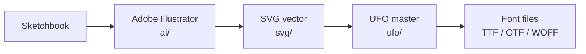

# Design Sketches

Every OctalFont glyph originates as a pencil drawing in a physical sketchbook.
Proportions, geometry, and stroke logic are resolved on paper before any
digital work begins. This page describes the full workflow from sketchbook
to UFO master.

## Workflow Overview

### 0. Physical Sketch

Glyphs are designed by hand in a sketchbook. The sketch establishes:

- Overall proportions and stroke weight
- Geometric construction (which arcs, lines, and corners to use)
- Negative space and counter shape

### 1. Adobe Illustrator Source

Sketch concepts are redrawn or traced in **Adobe Illustrator** and saved as
`.ai` files under `sources/<Family>/ai/` in the relevant category subfolder
(`uppercase/`, `lowercase/`, `numerals/`, `punctuation/`, `symbols/`).

> [!NOTE]
> Files in `ai/` are **not** consumed directly by the build pipeline. They
> serve as the intermediate working files before the final SVG export.

### 2. SVG Refinement

Glyphs are exported from Adobe Illustrator as SVG files into
`sources/<Family>/svg/` and slightly hand-tuned if needed.
The exported files are ready to be consumed by the build pipeline as-is.

### 3. UFO Export

The `tools/python/svg_to_ufo.py` script reads the SVG files, applies the
coordinate mapping defined in `metrics.yaml`, and writes `.glif` files into
the appropriate UFO master under `sources/<Family>/ufo/`.

> [!TIP]
> This step is automated - `svg_to_ufo.py` is called by the build pipeline
> automatically. You do not need to run it manually during a normal build.

#

###### Table of Contents

- [Index](../../README.md)
- [Licensing](../../licensing.md)

## Design

- [Overview](../README.md)
- [Sketches](../sketches/README.md)

## Technical

- [Metrics](../../technical/metrics.md)
- [Axes](../../technical/axes.md)
- [Building the Font](../../technical/build.md)
