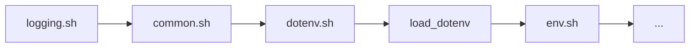
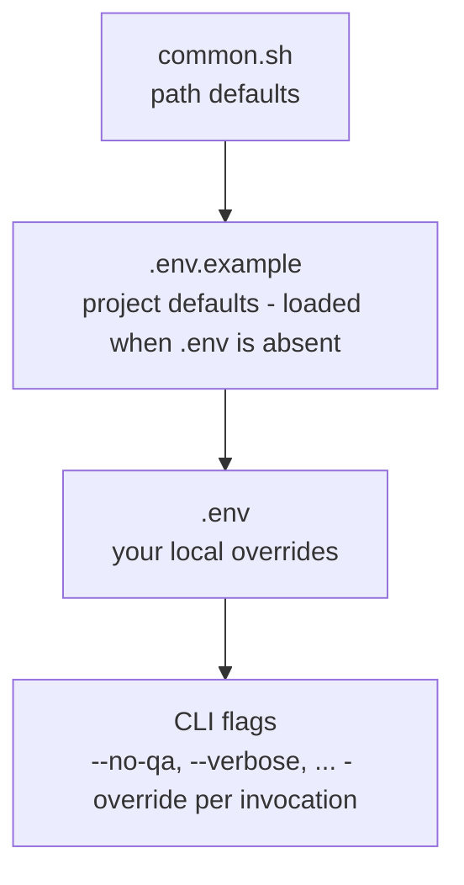

# Configuration

All runtime settings for the OctalFont build toolchain are controlled through a
single `.env` file at the repository root. The file is loaded automatically
every time the `octalfont` CLI starts - no command-line flags or script edits
needed.

> [!IMPORTANT]
> At least one of `.env` or `.env.example` **must** exist and contain active
> values. The toolchain has no built-in defaults - if neither file is found
> (or both are empty), `octalfont` aborts immediately with a fatal error.

## How It Works

| File           | Tracked in git    | Purpose                                                                                        |
|----------------|-------------------|------------------------------------------------------------------------------------------------|
| `.env.example` | ✅ yes             | Ships with the repo; defines project-wide defaults; loaded automatically when `.env` is absent |
| `.env`         | ❌ no (gitignored) | Your local overrides; takes precedence over `.env.example`                                     |

**Load order** inside `octalfont`:



`load_dotenv` sources either `.env` (preferred) or `.env.example` (fallback)
using `set -a`, so every key=value pair is automatically exported to the
environment of all child processes.  If neither file is usable, the process
exits with a fatal error before any build work begins.

## Reference

### Logging

| Variable         | Default             | Description                                                                     |
|------------------|---------------------|---------------------------------------------------------------------------------|
| `LOG_LEVEL`      | `INFO`              | Console verbosity. One of `DEBUG` `INFO` `SUCCESS` `WARN` `ERROR` `FATAL` `OFF` |
| `LOG_ERASE_DAYS` | `7`                 | Days to keep old log directories in `logs/`. `-1` disables cleanup              |
| `LOG_DIR`        | `${REPO_ROOT}/logs` | Per-run log subdirectories                                                      |
| `NO_COLOR`       | *(unset)*           | Set to any non-empty value (e.g. `1`) to suppress ANSI colour codes             |

### Build

| Variable      | Default | Description                                                            |
|---------------|---------|------------------------------------------------------------------------|
| `BUILD_NO_QA` | `0`     | Set to `1` to skip fontbakery QA after every build (same as `--no-qa`) |

## Precedence

Settings are applied in this order, last writer wins:



So a value set in `.env` always beats `.env.example`, and a CLI flag always
beats both.

## Automation / CI

In CI environments you typically don't have a `.env` file. Set variables
directly in the pipeline environment instead - they are picked up before
`load_dotenv` runs and take the same effect:

```yaml
# GitHub Actions example
env:
  LOG_LEVEL: INFO
  BUILD_NO_QA: 1
  NO_COLOR: 1
```

#

###### Table of Contents

- [Index](../README.md)
- [Licensing](../licensing.md)

## Design

- [Overview](../design/README.md)
- [Sketches](../design/sketches/README.md)

## Technical

- [Metrics](metrics.md)
- [Axes](axes.md)
- [Building the Font](build.md)
- [Configuration](configuration.md)
